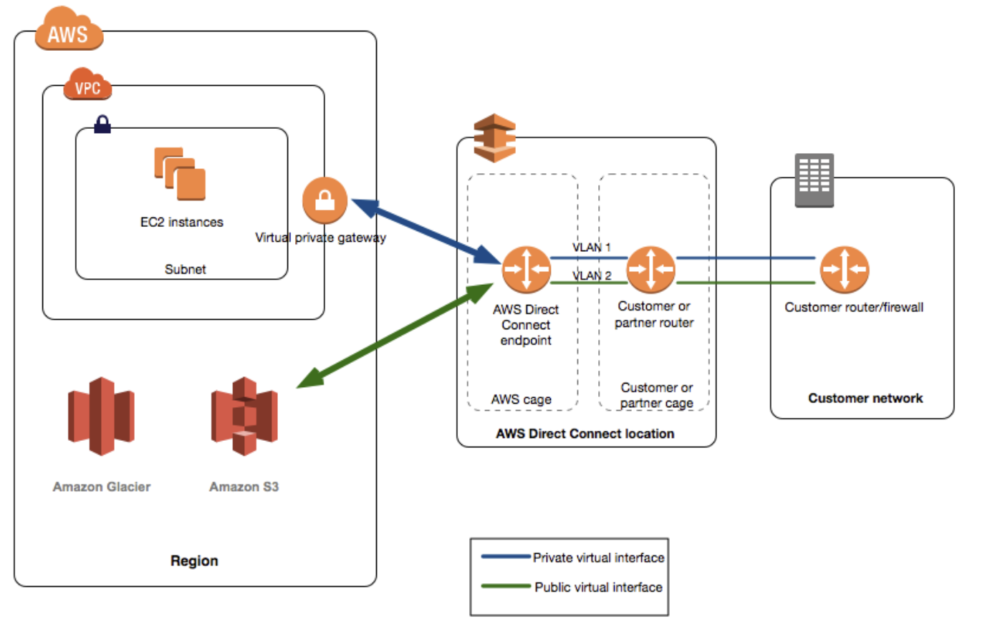
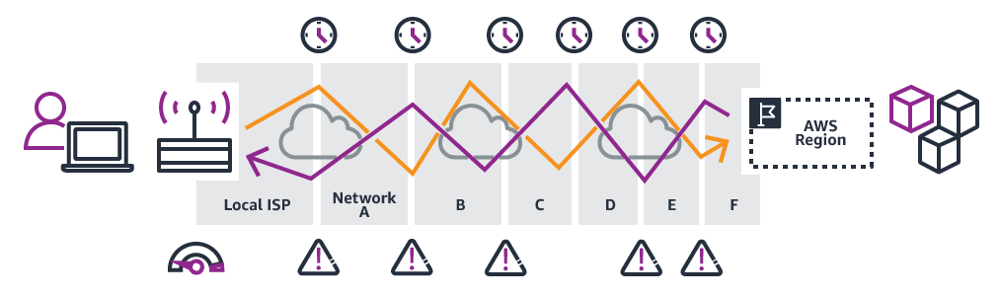
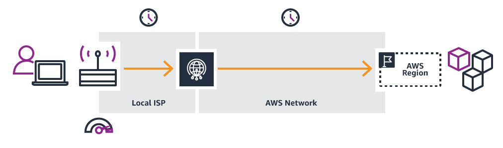
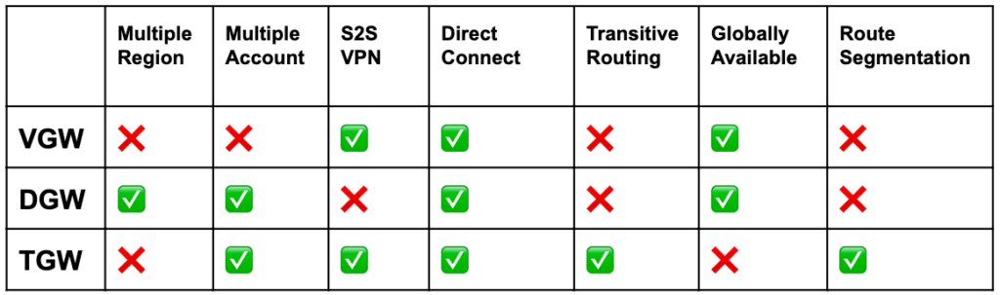

Cloud 全体Map

 # 1 分野
- コンピューティング 
- コスト管理 
- データベース 
- 災害対策 
- 高可用性 
- マネジメントとガバナンス 
- マイクロサービスとコンポーネントのデカップリング 

- 5.2 移行とデータの転送 

- ネットワーキング、接続、コンテンツ配信 
- セキュリティ 
- サーバーレスの設計原則 
- ストレージ

# 2 AWS のサービスと機能 
## 2.1 アナリティクス
- Amazon Elasticsearch Service (Amazon ES) 
- Amazon EMR 
- AWS Glue 
- Amazon Kinesis ストリーミング処理
- Amazon Athena  S3をデータベースとしてSQL文で検索など
- Amazon QuickSight　データ可視化ツール
## 2.2 AWS の請求情報とコスト管理
- AWS Budgets 
- Cost Explorer 

## 2.3 アプリケーション統合

- Amazon Simple Notification Service (Amazon SNS) 

  サブスクライブしているエンドポイントまたはクライアントへのメッセージの配信または送信を、調整および管理するウェブサービス

  

- Amazon Simple Queue Service (Amazon SQS) 

  

- SQS　VS　SNS

  - SQS：キューを `ポーリング` して取得する キューイングサービス

    

  - SNS：メッセージを `プッシュ式` で送る メッセージングサービス

    

## 2.4 コンピューティング
- Amazon EC2 

- AWS Elastic Beanstalk 

  各種サーバを提供している。Javaを例すると、Warをアップロードすれば、起動できます。起動必要なものを全部AWBより提供する。

  - 自動的に、**EC2 instance**　**Instance security group**　**Load balancer**　**Load balancer security group**　**Auto Scaling group**　**Amazon S3 bucket**　**Amazon CloudWatch alarms**　**Amazon CloudFormation stack**　**Domain name** 　が生成される

- Amazon Elastic Container Service (Amazon ECS) 

- Amazon Elastic Kubernetes Service (Amazon EKS) 

- Elastic Load Balancing 

  ELBと=ALB(Application)+CLB(Classic)+NLB(Network)

- AWS Fargate 

- AWS Lambda
## 2.5 データベース
- Amazon Aurora 

  AWS独自のRDS、Mysql、Postgresと交換している。ReadDBとWriteDB　3箇所AZ

- Amazon DynamoDB 

  NosqlDB　　自動3箇所AZ　グローバルテーブル　「DynamoDB ストリーム」

- Amazon ElastiCache 

  インメモリDB

- Amazon RDS 

- Amazon Redshift 

  データハウス

- Amazon Neptune   フルマネージド　グラフDB Service

  
## 2.6 マネジメント、ガバナンス
- AWS Auto Scaling 

- AWS Backup 

- AWS CloudFormation 

  AWSリソースをコードで管理できるサービス

- AWS CloudTrail 

  AWS CloudTrail は、AWS アカウントのガバナンス、コンプライアンス、および運用とリスクの監査を行えるように支援する AWS のサービスです。ユーザー、ロール、または AWS のサービスによって実行されたアクションは、CloudTrail にイベントとして記録されます。イベントには、AWS Management Console、AWS Command Line Interface、および AWS SDK と API で実行されたアクションが含まれます。

- Amazon CloudWatch 

  メトリクス監視、標準：CPU使用率　DiskReadOps（読み回数）　DiskReadBytes(読むバイト数) 　NetWorkIn（受信バイト数）

  5分間無料（サービスごと異なる）、15カ月

- AWS Config 

- Amazon EventBridge (Amazon CloudWatch Events) 

- AWS Organizations 

- AWS Resource Access Manager 

- AWS Systems Manager 

- AWS Trusted Advisor 

### 2.6.1 CloudTrail VS  AWS Config 

- CloudTrail : `ユーザの操作に対して` モニタリングをし、不正なことが起こってないかを確認する       　　　 目的：人

- Config : `リソースに対して` モニタリングをし、決定されたガイドラインに沿ってるかの確認を行う　　　　目的：リソース

- Access Advisor　　Access AdvisorのLast Accessed DataにIAMエンティティ(ユーザー、グループ、ロール) が最後にAWSサービスにアクセスした⽇付と時刻が表⽰されます。AWS Identity and Access Management (IAM) アクセスアドバイザーでは、AWS コマンドラインインターフェイス (AWS CLI) または SDK で IAM アクセスアドバイザー API を使用することで、すべてのアカウントで IAM アクセス権限の分析を自動化できます。IAM アクセスアドバイザーは、サービスアクセス監査、不要なアクセス権限の削除、IAM エンティティ (ユーザー、ロール、グループなど) が AWS サービスに最終アクセスしたタイムスタンプ取得のための適切なアクセス権限の設定を支援します。

  讲座 40：**IAMの概要** 已讨论了这一点

## 2.7 移行、転送
- AWS Database Migration Service (AWS DMS) 
- AWS DataSync 
- AWS Migration Hub 
- AWS Server Migration Service (SMS) 
- AWS Snowball 
- AWS Transfer Family 

## 2.8 ネットワーク、コンテンツ配信
- Amazon API Gateway 

  AWS Lambda、EC2、もしくはAWS外でパブリックとして公開されているアプリケーションをAPIとして公開する

- Amazon CloudFront 

  AWSが提供するCDN（Content Delivery Network）サービス   `Lambda@Edge`

- AWS Direct Connect 

  お客様の施設から AWS リージョンへのネットワーク接続を確立

  

- AWS Global Accelerator 

  ALB、NLB、EC2の前段に置いてアプリケーションの可用性とパフォーマンスを改善するサービス

  

  

- Amazon Route 53 

  フルマネージド型のDNSサービス

- AWS Transit Gateway 

- Amazon VPC (および関連機能) 

- 比較

  

   Transit Gateway       Direct Connect Gateway(DXGW)      Virtual Gateway   

## 2.9 セキュリティ、アイデンティティ、コンプライアンス
- AWS Certificate Manager (ACM) 

  ACMはSSL/TLSサーバー証明書を無料で発行できるサービス

- AWS Directory Service 

- Amazon GuardDuty 

- AWS Identity and Access Management (IAM) 

- Amazon Inspector 

- AWS Key Management Service (AWS KMS) 

- Amazon Macie 

- AWS Secrets Manager 

- AWS Shield 

- AWS Single Sign-On 

- AWS WAF 

- AWS Cognito

## 2.10 ストレージ

プロビジョンド IOPS SSD (io2 Block Express、io2、および io1)、汎用 SSD (gp3 および gp2)、スループット最適化 HDD (st1)、 Cold HDD (sc1)

- Amazon Elastic Block Store (Amazon EBS) 　　　　HD

  - https://aws.amazon.com/jp/ebs/features/#Amazon_EBS-Optimized_instances

  - https://aws.amazon.com/cn/ebs/faqs/

  - https://aws.amazon.com/jp/ebs/faqs/?nc1=h_ls

    | 名称                         | 特徴 |                                                      |
    | ---------------------------- | ---- | ---------------------------------------------------- |
    | IOPS SSD(io2 Block Express)  |      | R5b インスタンスのみで使用可能                       |
    | IOPS SSD(io2)                |      | R5b. を除くすべての EC2 インスタンスタイプで使用     |
    | IOPS SSD(io1)                |      |                                                      |
    | 汎用 SSD (gp2)               |      |                                                      |
    | 汎用 SSD (gp3)               |      |                                                      |
    | スループット最適化 HDD (st1) |      | アクセス頻度が高いスループット集約型ワークロード向け |
    | Cold HDD (sc1)               |      | アクセス頻度の低いワークロード向け                   |

    

- Amazon Elastic File System (Amazon EFS) 　　　linux向けの共通ファイルサーバ　　

- Amazon FSx 　　　　　Windows・linux向けの共通ファイルサーバ

- Amazon S3 

  - https://aws.amazon.com/cn/s3/storage-classes/

    |                                                          |                                                              |      |
    | -------------------------------------------------------- | ------------------------------------------------------------ | ---- |
    | Amazon S3 標準 (S3 標準)                                 | 頻繁にアクセスされるデータ向け                               |      |
    | Amazon S3 Intelligent-Tiering (S3 Intelligent-Tiering)   | 存続期間が長くあまり頻繁にアクセスされないデータ向け         |      |
    | Amazon S3 標準 – 低頻度アクセス (S3 標準 – IA)           | アクセスパターンが変化、または不明な存続期間が長いデータ向け |      |
    | Amazon S3 1 ゾーン – 低頻度アクセス (S3 1 ゾーン – IA)   | 存続期間が長くあまり頻繁にアクセスされない、且つ重要度の低いデータ向け |      |
    |                                                          |                                                              |      |
    | Amazon S3 Glacier (S3 Glacier)                           | 取得時間が数分から数時間許容される長期アーカイブデータ向け   |      |
    | Amazon S3 Glacier Deep Archive (S3 Glacier Deep Archive) | 取得時間が12時間許容される長期アーカイブデータ向け           |      |

    

- Amazon S3 Glacier 

- AWS Storage Gateway

  |                                  |                                                              |      |
  | -------------------------------- | ------------------------------------------------------------ | ---- |
  | ファイルゲートウェイ             |                                                              |      |
  | キャッシュボリュームゲートウェイ | オンプレミスのアプリケーションサーバーから iSCSI (Internet Small Computer System Interface) デバイスとしてマウントできる |      |
  | 保管ボリュームゲートウェイ       |                                                              |      |
  | テープゲートウェイ               |                                                              |      |

  

Amazon EBS – EC2用仮想ハードディスク。EC2からマウントして使用。

Amazon S3 – クラウド型オブジェクトストレージサービス。EC2と組み合わせて運用する場合はStorage Gatewayサービスを使用する。

Amazon EFS – EC2用のNAS相当。複数のEC2からのマウントが可能。Linux限定。 Multi-AZ file system for NFS file shares

Amazon FSx for Lustre – Designed for distributed high performance computing workloads

Amazon FSx for Windows File Server – EFSのWindows対応版。OSがWindowsのEC2で使用。Designed to support SMB file shares in a Single-AZ or Multi-AZ configuration

|                  | EBS              | EFS                                              | FSx                   |
| ---------------- | ---------------- | ------------------------------------------------ | --------------------- |
| AZ               | AZ内冗長         | AZ間冗長                                         | Multi・Single         |
| HDD/SSD          | HDD・SSD         |                                                  | HDD・SSD              |
| 作成後サイズ調整 | 可能             | 自動スケーリング                                 | 可能                  |
| プロトコル       | ー               | NFS                                              | SMB                   |
| バックアップ     | スナップショット | スナップショットできない AWS Backupと連携して | AWSへバックアップ可能 |
| 暗号化           | 任意暗号化       | 任意暗号化                                       | 自動暗号化            |
| 料金             | 安い             | 高い                                             | 中                    |

# 3 単語集

- IOPS    Input/Output Per Second
- SAN     Storage Area Network

AWS STS はAWS Security Token Service

# 4 各種ゲートウェイ

- インターネットゲートウェイ（IGW）

  インターネットゲートウェイは、VPC とインターネットとの間の通信を可能にする VPC コンポーネントであり、冗長性と高い可用性を備えており、水平スケーリングが可能です。 VPCないで内部冗長性があり、一つだけよい（ELBも）

- NATゲートウェイ（NAT）

  プライベートサブネットからインターネットにアクセスできるためのリソース。AZ内で冗長となっていますが、AZ間の冗長がないため、複数AZがあれば、複数作成必要

- Egress-Only インターネットゲートウェイ

# 4 リソース

 

http://jayendrapatil.com/    

 

 

www.briefmenow.org/amazon

https://awsjp.com/

https://www.lleicloud.com/index.php/aws-certified-solutions-architect-practice-tests/  

## 4 AWS Route53

# 5 メモ

## 5.1 サービス範囲

- グローバルサービス

- リージョンサービス

- アベイラビリティゾーンサービス

# TODO

CloudFront 課金　構成　接続ポイント

Hadoop　？？

ELB で　SSL証明書をインストールして通信する　　　　ＡＣＭでＳＳＬ　　証明書管理のみ！！！

Role 別のアカウントに付与する・・・

AWS Organizations   Service  SCP

->  権限の設定ではなくて、Policy自体は設定できない。設定済みのものは？　　　境界設定
